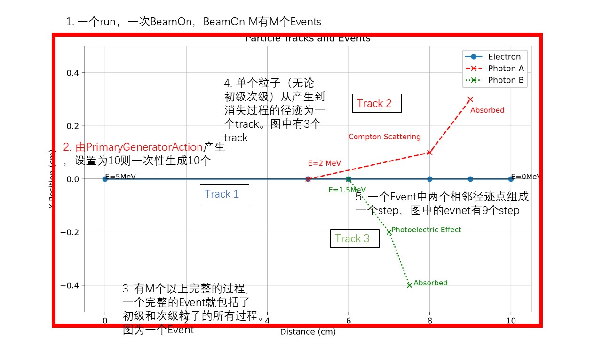

<!--
 * @Author: mtz nuaamzt@nuaa.edu.cn
 * @Date: 2025-05-21 11:36:54
 * @LastEditors: mtz nuaamzt@nuaa.edu.cn
 * @LastEditTime: 2025-05-21 16:17:48
 * @FilePath: /betatron/readme.md
 * @Description: 
-->
# G4程序模板

1. G4的基本模块都实现了
2. 只创建了世界
3. 在runAction中定义了root文件，把run,event和step的运行次数以His和Tree的方式保存下来

一个完整通用的g4模拟就完成了。  
## 重要的提示有:  
1. 因为要用到多线程，所以main函数中的SetUserInitialization完成之后，没有马上initialize这个runManager。而是在mac文件第一行先改了多线程后在initialize。因此自己写
新的mac的时候，下面两句开头是必须的：
   ```
   /run/numberOfThreads 10
   /run/initialize
   ```
1. Run-Event-Step的关系如下：

   
   本项目还没有遇到需要用到track的情形

2. 使用G4AnalysisManager来创建和保存root文件的时候，
   一定一定要注意线程问题，因为工作线程只创建了文件，所以所有的填充都在工作线程，最后的合并是在工作线程！

3. 两个action之间进行数据交换的时候一定保证要用到G4Accumulable这个容器作为中间变量，这样才能保证多线程的情况下，数据不会出错！！！这很重要！除非你不用多线程！！！